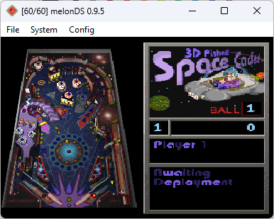

# 3D Pinball - Space Cadet for DS

Port of 3D Pinball - Space Cadet to the Nintendo DS, based on the [decompilation project](https://github.com/k4zmu2a/SpaceCadetPinball)

Built with the [BlocksDS SDK](https://github.com/blocksds/sdk)

Game data from 3D Pinball Space Cadet (Windows 95 Plus, Windows XP...) must be placed in `SD card/data/SpaceCadetPinball`

This port has some bugs:
* CADET.DAT from Full Tilt! Pinball does not work. Most likely due to having higher-resolution bitmaps and running out of memory while loading.
* When loading the game in DS mode, some of the lights on the pinball table do not work correctly as a side effect of the bitmaps being downscaled by half.
  * This is not present in DSi mode, as the bitmaps are not downscaled there.
