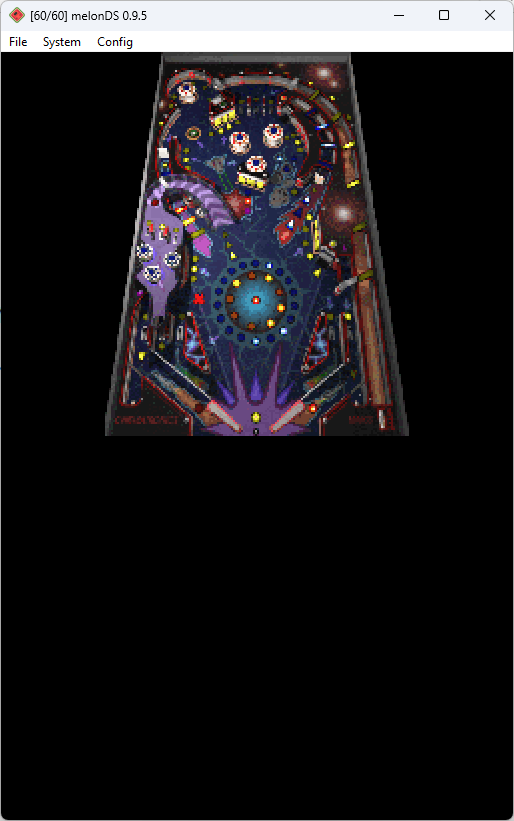

# 3D Pinball - Space Cadet for DS(i)

Port of 3D Pinball - Space Cadet to the Nintendo DS(i), based on the [decompilation project](https://github.com/k4zmu2a/SpaceCadetPinball)

Built with the [BlocksDS SDK](https://github.com/blocksds/sdk)

This port has several bugs:
* Does not run on original DS due to running out of memory while loading. It can only run in DSi mode
* Can't load all sound files due to running out of memory
* Runs extremely slow
